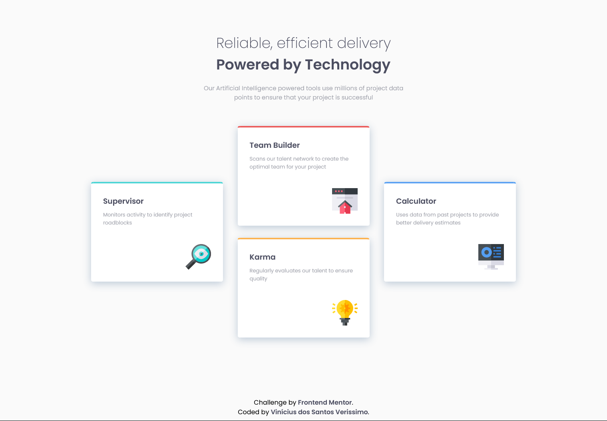

# Frontend Mentor - Four card feature solution

## Overview

### Screenshot

### Links

- Solution URL: Working on it.

## My process

### Built with

- Semantic HTML5 markup
- CSS custom properties
- Flexbox

### What I learned

In this project i could use the flexbox features to position the cards like the proposed layout, by creating a flex container with 3 flex itens.

By doing that i was able to centralize the cards at the ends and put change the position of the cards inside the item at the middle.

## Author

- GitHub - Vinícius dos Santos Verissimo (https://github.com/viniciusdsv93)
